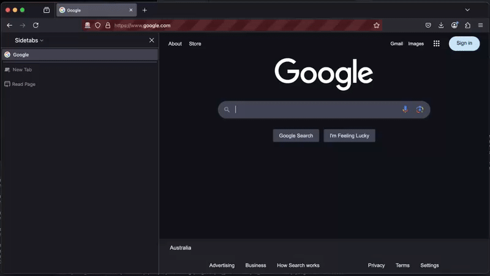

# Firefox Extension for Stack Overflow AI Input



With Google search results becoming less reliable, it’s easy to paste all questions into a LLM chat and hope for a quick fix. However, LLMs often hallucinate, providing wrong answers or fabricated dependencies, which can cause setbacks. This is particularly frustrating when you find that a perfectly good answer is already available on Stack Overflow or in the official documentation.

I figured it would be helpful if the LLM received better input or had its output verified before generating an answer. A bit like a RAG. So, after experimenting with Tauri, Electron, and some hacking around, I finally decided to test creating a Firefox extension.

Once done I found the `@web` context command in [continue.dev](https://github.com/continuedev/continue) that does something similar. There is a `@docs` context as well but not sure if checks are done to validate that methods and dependencies actually exists.

## How It Works

The flow is straightforward:
1. Perform a Google search for the question and extract the results.
2. If the search results contain a Stack Overflow link, query the Stack Exchange API to retrieve accepted answers.
3. Add these accepted answers to the chat prompt as additional context and run on a quick local model.

The concept worked, though it’s not the most convenient to use. After some tuning, the Google search result parser performed well, It may not be stable thought, since it depends on a hard coded class and I assume Google makes an effort to prevent these parsers. However I came across a repo using the same hardcoded class name that hadn't changed in two years so maybe it's fine.

## Parsing Google Search Results

The idea is to look for a link and an `h3` element, along with one of the hardcoded class name for the description, ensuring they share the same parent somewhere in the tree.

Inspired by [github.com/nrjdalal/google-parser](https://github.com/nrjdalal/google-parser)

```typescript
const MAGIC_DESCRIPTION_CLASS_NAME = ".VwiC3b";

function extractGoogleSearchResults(document: Document): SearchResult[] {
  const container = document.getElementById("search");
  if (!container) {
    console.warn("No container with id 'search' found.");
    return [];
  }

  const descriptions = Array.from(
    container.querySelectorAll<HTMLElement>(MAGIC_DESCRIPTION_CLASS_NAME)
  );

  const results: SearchResult[] = [];

  for (const desc of descriptions) {
    let current: HTMLElement | null = desc.parentElement;

    while (current && current !== container) {
      const h3 = current.querySelector("a h3");
      const link = h3?.closest("a");

      if (link instanceof HTMLAnchorElement && current.contains(desc)) {
        results.push({
          href: link.href,
          title: h3.textContent?.trim() ?? "",
          description: desc.textContent?.trim() ?? "",
        });
        break; // Found the pair, no need to go higher
      }

      current = current.parentElement;
    }
  }

  return results;
}
```

## Stack Exchange / Stack Overflow API

Stack Exchange provides a simple API for fetching questions and answers, though it’s limited to 300 requests per day.

Example API call:
```
GET https://api.stackexchange.com/2.3/questions/${questionId}/answers?site=stackoverflow&filter=withbody
```

Example response:
```json
{
  "items": [
    {
      "is_accepted": true,
      "body": "..."
    },
    ...
  ]
}
```

## Firefox Extension

I came across an extension with a sidebar and a tab list (https://github.com/jeb5/Sidetabs/) that looked nice, so I squeezed the new code into it with a small effort.

The same issue as with the Firefox AI sidebar appeared: since it sends a GET request with the entire query, it often gets truncated. To work around this, the extension opens a new tab to `llama.cpp`'s server, where the query is pasted directly into the text box. This allows the user to modify the prompt before submitting it.

Most of the code is fairly straightforward React inside `Sidebar.tsx`. The `content-script` is probably where the most extension magic happens. It reads the page document and pastes the prompt back. A delay was needed to wait for the tab to open before trying to interact with it.

`src/content/content-script.ts`
```typescript
  browser.runtime.onMessage.addListener((request, sender, sendResponse) => {
    if (request.type === "PARSE_PAGE") {
        sendResponse(extractGoogleSearchResults(document));
    } else if (request.type === "PASTE_PROMPT") {
      document.getElementById("msg-input").value = request.query;
    }
  });
```
`src/manifest.json`
```json
  {
    ...
    "permissions": [
      ...
      "activeTab",
    ]
  }
```
