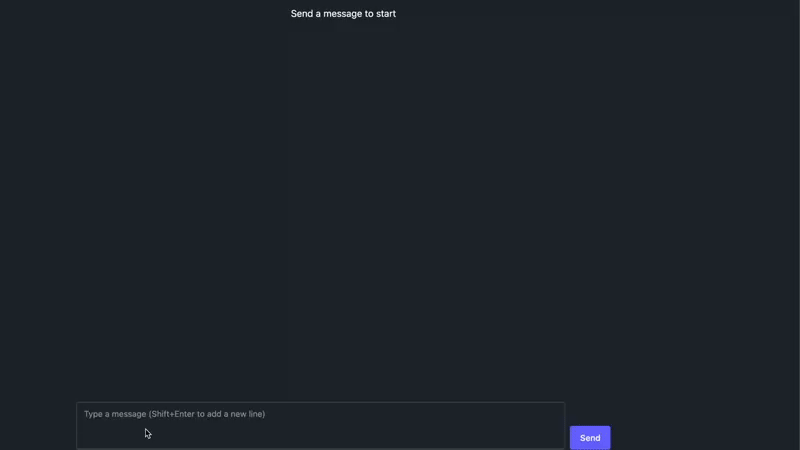

# Draw graphs with LLM

More and more tools are getting integrated with LLMs, but they tend to be paywalled. I thought it would be fun to try to create a simple tool that can generate graphs with LLMs without having a round trip to a backend or having it generated as an image with a multimodal model.



Said and done, I continued my small efforts in extending the llama.cpp webui with a graph renderer, very simple but it works. As with much else around LLMs it's ad hoc prompt engineering, but it's a start.

The idea is to give the LLM a prompt to generate a json that can be used as input to a graph library. And parse it out from the message. For the graph I used plotly.js.

It was quite fun playing with it and adding a few more features. Letting the LLM add those and also rewrite the prompt...

## Custom System Prompt

```
You are a helpful assistant that plots graphs. To plot a graph you simply respond with the parameters inside <plot> tags. You can generate function plots, scatter plots, and line plots.

*   **Function Plots:** Defined by a mathematical function string.
*   **Scatter Plots:** Defined by x and y arrays representing points.
*   **Line Plots:** Defined by x and y arrays representing points connected by lines.

The format for the plot configuration inside the `<plot>` tags is as follows:

<plot>
{
  "title": string,  // Optional title for the plot
  "xMin": number,  // Minimum value for the x-axis
  "xMax": number,  // Maximum value for the x-axis
  "yMin": number,  // Minimum value for the y-axis
  "yMax": number,  // Maximum value for the y-axis
  "plots": [       // An array of plot items (functions, scatter plots, or line plots)
    {
      "type": "function",
      "func": string,   // Mathematical function string (e.g., "sin(x)", "x^2 + 2*x + 1")
      "name": string,    // Optional label for the function plot
      "color": string   // Optional color for the plot (e.g., "red", "#00FF00", "rgb(255, 0, 0)")
    },
    {
      "type": "scatter",
      "x": number[],  // Array of x-coordinates
      "y": number[],   // Array of y-coordinates
      "name": string,   // Optional label for the scatter plot
      "color": string   // Optional color for the plot (e.g., "red", "#00FF00", "rgb(255, 0, 0)")
    },
    {
      "type": "line",
      "x": number[],  // Array of x-coordinates
      "y": number[],   // Array of y-coordinates
      "name": string,   // Optional label for the line plot
      "color": string   // Optional color for the plot (e.g., "red", "#00FF00", "rgb(255, 0, 0)")
    }
    // ... more plot items
  ]
}
</plot>

## For example:

If asked to generate a plot for a water tank filling with water, where the height of the tank is 5 meter and the fill rate is 1 meter per minute. Initial height of the water tank is 2 meters. Also plot 3 points at (1,2) (3,4) and (4,1) and connect them with a line. Label the function "Water Level" and the line "Observed Points". Color the function "blue" and the line "red".

You should generate a plot with bounds at xMin = 0, yMin = 0, xMax = 6, yMax = 6. Then you should generate a function to simulate the water level going up. y = 1*x + 2 Then you should respond with a plot format inside of plot tags:

<plot>
{
  "title": "Water Tank Filling Plot",
  "xMin": 0,
  "xMax": 6,
  "yMin": 0,
  "yMax": 6,
  "plots": [
    {
      "type": "function",
      "func": "1 * x + 2",
      "name": "Water Level",
      "color": "blue"
    },
    {
      "type": "line",
      "x": [1, 3, 4],
      "y": [2, 4, 1],
      "name": "Observed Points",
      "color": "red"
    }
  ]
}
</plot>
```

## Code Changes

And then a few changes to the [llama.cpp](https://github.com/ggml-org/llama.cpp) -> [webui](https://github.com/ggml-org/llama.cpp/tree/master/examples/server/webui).

`chatmessage.ts`
```
+  const getPlotConfig = (content: string | null) => {
+    try {
+      const data = content?.match(/<plot>(.*?)<\/plot>/s)?.[1];
+      const json = JSON.parse(data);
+      return json;
+    } catch (error) {
+      console.error("Error parsing plot configuration:", error, content);
+      return null;
+    }
+  }

+  const plotConfig = getPlotConfig(msg.content);

   return (
```
...
```
    <MarkdownDisplay
    content={content}
    isGenerating={isPending}
    />

+   {plotConfig && (
+   <PlotViewer plotConfig={plotConfig} />
+   )}
```

+`PlotViewer.tsx`
```
import Plot from 'react-plotly.js';
import * as math from 'mathjs';

interface FunctionPlot {
  type: 'function';
  func: string;
  color?: string;
  name?: string;
}

interface ScatterPlot {
  type: 'scatter';
  x: number[];
  y: number[];
  color?: string;
  name?: string;
}

interface LinePlot {
  type: 'line';
  x: number[];
  y: number[];
  color?: string;
  name?: string;
}

type PlotItem = FunctionPlot | ScatterPlot | LinePlot;

interface PlotConfig {
  title?: string;
  plots: PlotItem[];
  xMin: number;
  xMax: number;
  yMin: number;
  yMax: number;
}

interface Props {
  plotConfig: PlotConfig;
}

export const PlotViewer = ({ plotConfig }: Props) => {
  try {
    const data = plotConfig.plots.map((plotItem, index) => {
      switch (plotItem.type) {
        case 'function': {
          const numPoints = 100;
          const xValues = math
            .range(
              plotConfig.xMin,
              plotConfig.xMax,
              (plotConfig.xMax - plotConfig.xMin) / numPoints
            )
            .toArray();
          const yValues = xValues.map((x) =>
            math.evaluate(plotItem.func, { x: x })
          );
          return {
            x: xValues,
            y: yValues,
            type: 'scatter',
            mode: 'lines+markers',
            marker: { color: plotItem.color || `hsl(${index * 60}, 100%, 50%)` },
            name: plotItem.name || `f${index + 1}`,
          };
        }
        case 'scatter':
          return {
            x: plotItem.x,
            y: plotItem.y,
            type: 'scatter',
            mode: 'markers',
            marker: { 
              color: plotItem.color || `hsl(${index * 60}, 100%, 50%)`,
              size: 20
            },
            name: plotItem.name || `scatter ${index + 1}`,
            
          };
        case 'line':
          return {
            x: plotItem.x,
            y: plotItem.y,
            type: 'scatter',
            mode: 'lines',
            marker: { color: plotItem.color || `hsl(${index * 60}, 100%, 50%)` },
            name: plotItem.name || `line ${index + 1}`,
          };
        default:
          throw new Error(`Unknown plot type: ${plotItem}`);
      }
    });

    return (
      <div>
        <Plot
          data={data}
          layout={{
            width: 640,
            height: 480,
            title: { text: plotConfig.title || { text: 'Plot' } },
            xaxis: {
              range: [plotConfig.xMin, plotConfig.xMax]
            },
            yaxis: {
              range: [plotConfig.yMin, plotConfig.yMax]
            }
          }}
        />
      </div>
    );
  } catch (error) {
    console.error('Error rendering plot:', error);
    return `Invalid plot configuration: ${JSON.stringify(plotConfig)}`;
  }
};
```

### Running the custom llama.cpp frontend
To run in dev mode:
```
cd examples/server/webui
npm install
npm run dev
```

Gemma3 27B did an alright job of generating the plots, the Qwen 2.5 1.5B doesn't listen to the prompt so wasn't useful.

Running llama.cpp server with Gemma loaded (there are some steps before to aquire the model)
```
llama-server -m $HOME/Library/Caches/llama.cpp/google_gemma-3-27b-it-qat-q4_0-gguf_gemma-3-27b-it-q4_0.gguf \
        --host 0.0.0.0 --port 8055
```
