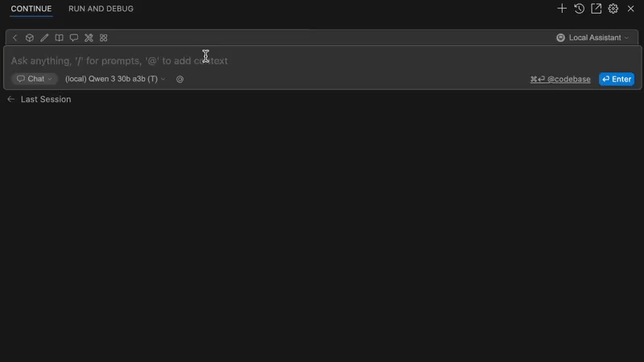

# Verify LLM dependencies

The LLM's are happy to make up any answers on your questions, including inventing dependencies that doesn't exist.

To deal with this in [continue.dev](https://github.com/continuedev/continue) for VSCode I created a little webserver that acts like a openai compatible completions endpoint. It parses the chat and looks for code and dependencies and checks if they exist.



How it works:

- It receives the chat and looks at the last assistant message for code and finds all unique dependencies.
- It looks at the last user message for a package.json and gets the existing dependencies.
- For all new dependencies it checks if they exists at registry.npmjs.org, and if not it returns a message listing the invalid ones.

An agent can probably integrate this in it's workflow with tool calls, but for now it's a manual step in the chat, by changing the chat model to our custom one and passing the package.json contents with help of a slashcommand.

Maybe this could have been done with the config.ts in continue.dev but it did not pick up changes for me right now, also it is marked as deprecated.

So first we add a new model to the config.yaml

```yaml ~/.continue/config.yaml
models:
  - name: (local) Dependency Checker
    provider: llama.cpp
    model: MODEL_NAME
    apiBase: http://localhost:3300
```

Then a slash command to simply pass the package.json contents to the chat.

```yaml ~/.continue/config.yaml
prompts:
  - name: Dependencies
    description: Verify dependencies in the mentioned files
    prompt: >
      Verify dependencies in the mentioned files. Here is the existing project dependencies: @package.json
```

Then of course we need to create the webserver. Current code is very experimental so will leave it out of here but put down a couple of snippet concepts.

This would be the overall structure extracted from the proof of concept:

```javascript main.js
function writeToStream(res, content, stop=false) {
    const baseResponse = {
        // this needs a few params or continue won't read the response
    }
    res.write(
        `data: ${JSON.stringify({
          ...baseResponse,
          content,
          stop,
        })}\n\n`
      );
}

expressApp.post("/completions", async (req, res) => {
    res.setHeader("Content-Type", "text/event-stream");
    res.setHeader("Cache-Control", "no-cache");
    res.setHeader("Connection", "keep-alive");

    // Pretend we are a thinking AI to log what we do
    writeToStream(res, '<think>')
    // Split on <|im|start> and <|im|end> and grab the operator
    const sections = parseTemplate(req.body.prompt);
    // Parse ```<language> filepath.ext\ncode...\n``` and extract dependencies for each code segment
    const sourceDependencies = await findSourceDependencies(sections);
     // Read package.json for dependencies and devDependencies
    const existingDependencies = await findExistingDependencies(sections);
    const newDependencies = sourceDependencies.filter((dep) => !existingDependencies.includes(dep));

    writeToStream(res, 'Looking up dependencies: ')

    const invalidDependencies = await Promise.all(
      newDependencies.map(async (dependency) => {
        writeToStream(res, `\`${dependency}\` `)

        // Query registry.npmjs.org for package, check 200 / 404 response codes
        const exists = await checkNpmPackageExists(dependency);
        return !exists ? dependency : null;
      })
    ).filter(dependency => dependency !== null)

    writeToStream(res, '</think>')

    if (invalidDependencies.length) {
      writeToStream(res, `Invalid dependencies: ${invalidDependencies}`, true)
    } else {
      writeToStream(res, `Dependencies are valid`, true)
    }

    res.end();
})
```
